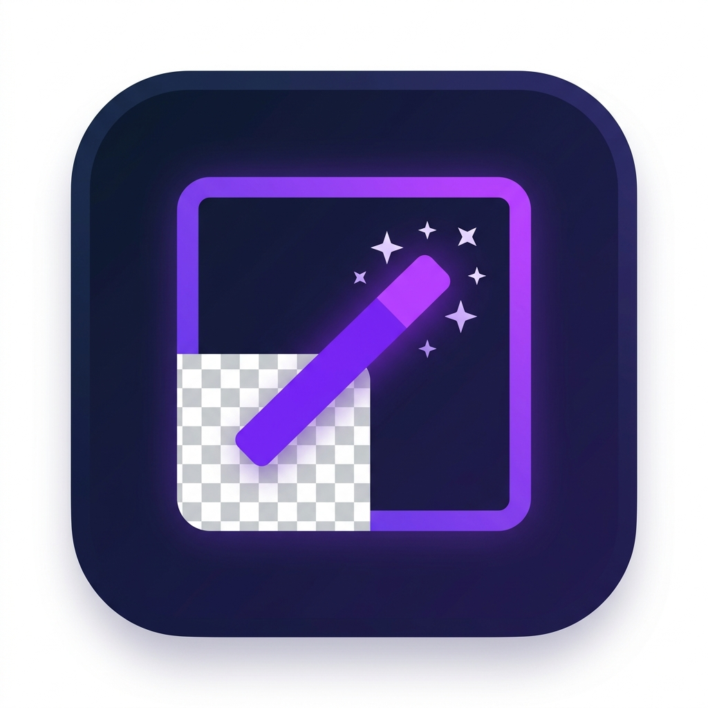
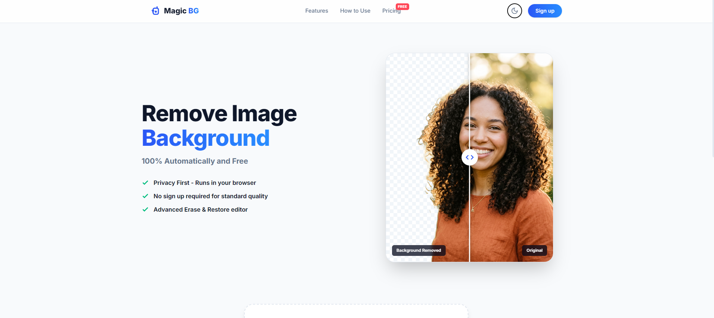
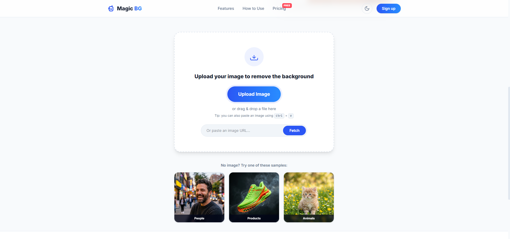
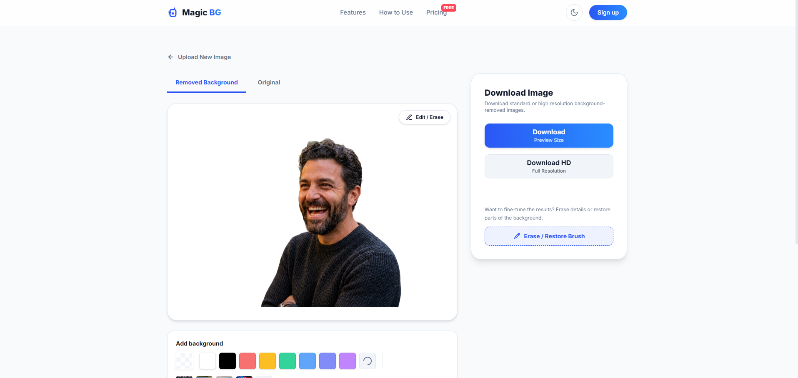

<p align="center">
  
</p>

<h1 align="center">Magic BG Remover</h1>

<p align="center">
  <strong>100% free, client-side background removal — powered by AI, running entirely in your browser.</strong>
</p>

<p align="center">
  <a href="#features">Features</a> •
  <a href="#screenshots">Screenshots</a> •
  <a href="#tech-stack">Tech Stack</a> •
  <a href="#getting-started">Getting Started</a> •
  <a href="#project-structure">Project Structure</a>
</p>

---

## Overview

**Magic BG Remover** is a privacy-first, browser-based background removal tool inspired by [remove.bg](https://www.remove.bg). Upload any image — a portrait, product photo, or pet picture — and the AI will instantly cut out the background, leaving a clean transparent PNG.

No uploads to any server. No account required. Your images never leave your device.

---

## Screenshots

### Hero — Before/After Comparison Slider


### Upload Zone — Drag, Drop, Paste or URL


### Result Viewer — Background Removed with Download & Editor


---

## Features

### 🤖 AI-Powered Background Removal
- Uses **[briaai/RMBG-1.4](https://huggingface.co/briaai/RMBG-1.4)** — a state-of-the-art segmentation model purpose-built for background removal
- Powered by **[Hugging Face Transformers.js](https://huggingface.co/docs/transformers.js)** — runs the AI model natively in WebAssembly with zero server dependency
- Model weights (~170 MB) are downloaded once and cached permanently in your browser's IndexedDB

### 🔒 Privacy First
- **100% client-side** — your images are never uploaded to any server
- No account, no API key, no watermarks
- Works offline after the initial model download

### 📤 Flexible Image Input
- **Upload** via file picker (JPG, PNG, WebP, and more)
- **Drag & drop** anywhere on the upload zone
- **Paste** from clipboard with `Ctrl` + `V`
- **Fetch from URL** — paste an image URL directly

### 🖼️ Interactive Before/After Slider
- Drag the hero slider to compare original vs. background-removed result in real time

### 🎨 Background Customizer
After removing the background, instantly preview and download your subject on:
- **Transparent** (checkerboard preview, downloads as PNG)
- **Solid color** — 8 preset swatches + a full color picker
- **Preset scene images** — Studio, Nature, Beach, Abstract
- **Custom background** — upload your own image

### ✏️ Erase & Restore Brush Editor
- Canvas-based brush tool to manually **erase** or **restore** parts of the result
- Adjustable brush size and mode toggle
- Undo / redo support

### ⬇️ Download Options
- Download at preview size or full HD resolution
- PNG with alpha transparency or composited with your chosen background

### 🌙 Light / Dark Mode
- System preference detection on first load
- Toggle in the header, persists across sessions via `localStorage`

### 🗂️ Sample Images
- Three built-in sample categories to try without your own photos: **People**, **Products**, **Animals**

---

## Tech Stack

| Layer | Technology |
|---|---|
| **Framework** | [SvelteKit](https://kit.svelte.dev/) with Svelte 5 (runes) |
| **Language** | TypeScript |
| **Styling** | [Tailwind CSS v4](https://tailwindcss.com/) |
| **AI Engine** | [@huggingface/transformers](https://github.com/huggingface/transformers.js) |
| **AI Model** | [briaai/RMBG-1.4](https://huggingface.co/briaai/RMBG-1.4) |
| **Build Tool** | [Vite 8](https://vite.dev/) |
| **Fonts** | Inter (Google Fonts) |

### Why `@huggingface/transformers`?

Earlier versions of this project used `@imgly/background-removal`, which suffered from a persistent `TypeError: r._OrtGetInputOutputMetadata is not a function` crash caused by WASM ABI incompatibilities in `onnxruntime-web`. Hugging Face Transformers.js **bundles its own compatible ONNX runtime**, making version conflicts impossible. It also provides access to a broader ecosystem of models on the Hugging Face Hub.

---

## Getting Started

### Prerequisites

- [Node.js](https://nodejs.org/) v18 or later
- npm

### Installation

```bash
# Clone the repository
git clone https://github.com/maestro-t/magic-bg-remover.git
cd magic-bg-remover

# Install dependencies
npm install
```

### Development

```bash
npm run dev
```

Open [http://localhost:5173](http://localhost:5173) in your browser.

> **Note on first use:** The AI model (`briaai/RMBG-1.4`, ~170 MB) is downloaded from Hugging Face on first image upload and cached in your browser. Subsequent uses are instant.

### Production Build

```bash
npm run build
npm run preview
```

> **Deployment note:** The server must send `Cross-Origin-Opener-Policy: same-origin` and `Cross-Origin-Embedder-Policy: credentialless` headers to enable `SharedArrayBuffer` for multi-threaded WASM inference. These are configured in [`src/hooks.server.ts`](src/hooks.server.ts) and [`vite.config.ts`](vite.config.ts).

---

## Project Structure

```
magic-bg-remover/
├── src/
│   ├── lib/
│   │   ├── backgroundRemoval.ts   # AI engine — loads RMBG-1.4 & runs inference
│   │   └── components/
│   │       ├── Header.svelte       # Navigation + theme toggle
│   │       ├── Hero.svelte         # Before/after comparison slider
│   │       ├── UploadZone.svelte   # File picker, drag & drop, URL fetch, paste
│   │       ├── ProcessingState.svelte # Loading / progress UI
│   │       ├── ResultViewer.svelte # Result preview + background customizer + download
│   │       ├── InteractiveEditor.svelte # Canvas brush erase/restore tool
│   │       └── Footer.svelte
│   ├── routes/
│   │   ├── +layout.svelte         # App shell, SEO, fonts, favicon
│   │   ├── +page.svelte           # Main page — orchestrates all stages
│   │   └── global.css             # Tailwind v4 + design tokens (CSS variables)
│   └── hooks.server.ts            # COOP/COEP headers for cross-origin isolation
├── static/
│   ├── hero-original.png          # Hero slider — original image
│   ├── hero-transparent.png       # Hero slider — background removed image
│   ├── favicon.png                # App icon
│   └── samples/                   # Built-in sample images (portrait, shoe, pet)
└── vite.config.ts                 # Vite config with Tailwind + WASM exclusions
```

---

## License

MIT
